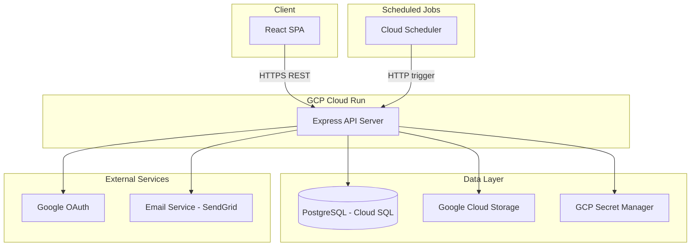
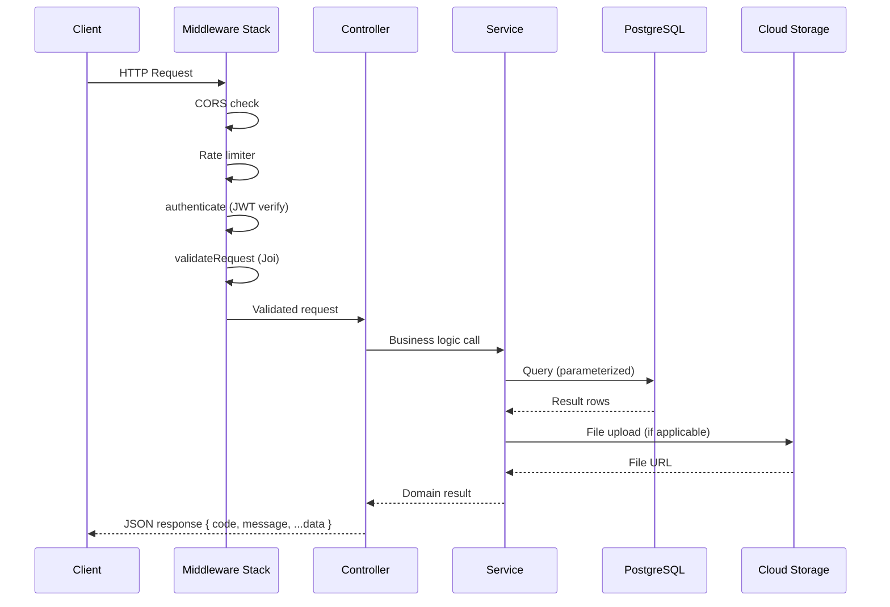
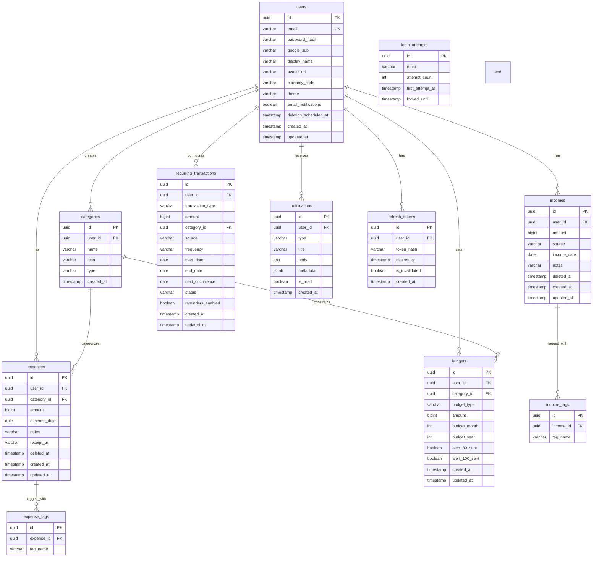
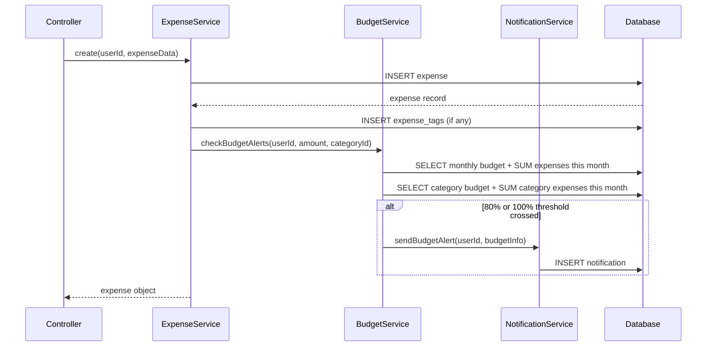
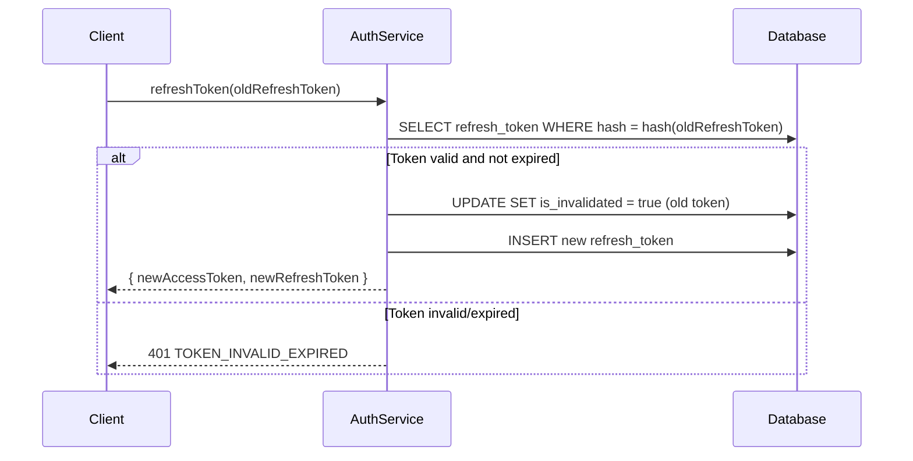

# Design Document: Expense Tracker

## Overview

The Expense Tracker is a full-stack personal finance application enabling users to track expenses and incomes, set budgets, generate reports, and receive actionable alerts. The backend is a Node.js/Express REST API backed by PostgreSQL, deployed on GCP Cloud Run. The frontend is a React SPA communicating via JSON APIs.

### Design Goals

- **Stateless API**: No in-memory session state; all auth via JWT tokens for horizontal scaling on Cloud Run
- **Clean separation**: Controllers handle HTTP concerns, services hold business logic, database access isolated in query modules
- **Soft deletion**: All user-generated records use `deleted_at` for recoverability and audit trails
- **Monetary precision**: All amounts stored as integers in the smallest currency unit (paise/cents) to avoid floating-point errors
- **Consistent response format**: Every endpoint returns `{ code, message, ...data }` per workspace conventions

### Key Design Decisions

| Decision | Rationale |
|----------|-----------|
| Store amounts as integers (paise) | Avoids floating-point rounding; display formatting handled at API boundary |
| Soft-delete with `deleted_at` | Supports grace-period account deletion, audit, and undo |
| JWT access + refresh token pair | Short-lived access tokens limit exposure; refresh rotation prevents replay |
| Cron-based recurrence engine | Cloud Run scheduled jobs fit GCP model; no persistent process needed |
| GCS for receipt/avatar storage | Integrates with Cloud Run IAM; no file system dependency |
| Joi validation middleware | Centralized, declarative schemas; consistent error codes |

## Architecture

### High-Level Architecture



### Request Flow



### Layered Architecture

```
├── src/
│   ├── routes/           # Express route definitions
│   ├── controllers/      # HTTP request/response handling
│   ├── services/         # Business logic layer
│   ├── queries/          # Raw SQL query modules (parameterized)
│   ├── validation/       # Joi schema definitions
│   ├── middlewares/      # Auth, validation, rate limiting, error handler
│   ├── config/           # DB pool, logger, GCS client, env config
│   ├── constants/        # Error codes, currency list, category defaults
│   ├── utils/            # Hasher, date helpers, pagination builder
│   └── jobs/             # Cron job handlers (recurrence, reminders, cleanup)
├── migrations/           # Numbered raw SQL migration files
├── app.js                # Entry point
└── package.json
```

## Components and Interfaces

### Component Diagram

```mermaid
graph LR
    subgraph Middleware Layer
        CORS[CORS]
        RL[Rate Limiter]
        AUTH_MW[Auth Middleware]
        VAL[Validation Middleware]
        ERR[Error Handler]
    end

    subgraph Route Layer
        R_AUTH[/api/auth]
        R_EXP[/api/expenses]
        R_INC[/api/incomes]
        R_DASH[/api/dashboard]
        R_BUD[/api/budgets]
        R_REC[/api/recurring]
        R_RPT[/api/reports]
        R_NOT[/api/notifications]
        R_SET[/api/settings]
    end

    subgraph Service Layer
        S_AUTH[AuthService]
        S_EXP[ExpenseService]
        S_INC[IncomeService]
        S_DASH[DashboardService]
        S_BUD[BudgetService]
        S_REC[RecurrenceService]
        S_RPT[ReportService]
        S_NOT[NotificationService]
        S_SET[SettingsService]
    end

    subgraph Data Access
        Q_USER[userQueries]
        Q_EXP[expenseQueries]
        Q_INC[incomeQueries]
        Q_CAT[categoryQueries]
        Q_BUD[budgetQueries]
        Q_REC[recurringQueries]
        Q_NOT[notificationQueries]
    end
```

### API Endpoints

#### Auth (`/api/auth`)

| Method | Path | Auth | Description |
|--------|------|------|-------------|
| POST | /register | No | Register with email/password |
| POST | /login | No | Login with email/password |
| POST | /google | No | Login/register via Google OAuth |
| POST | /refresh | No | Refresh access token |
| POST | /logout | Yes | Invalidate refresh token |
| POST | /change-password | Yes | Change password |

#### Expenses (`/api/expenses`)

| Method | Path | Auth | Description |
|--------|------|------|-------------|
| POST | / | Yes | Create expense |
| GET | / | Yes | List expenses (paginated, filterable) |
| GET | /:id | Yes | Get single expense |
| PATCH | /:id | Yes | Update expense |
| DELETE | /:id | Yes | Soft-delete expense |
| POST | /:id/receipt | Yes | Attach receipt image |

#### Incomes (`/api/incomes`)

| Method | Path | Auth | Description |
|--------|------|------|-------------|
| POST | / | Yes | Create income |
| GET | / | Yes | List incomes (paginated) |
| GET | /:id | Yes | Get single income |
| PATCH | /:id | Yes | Update income |
| DELETE | /:id | Yes | Soft-delete income |

#### Categories (`/api/categories`)

| Method | Path | Auth | Description |
|--------|------|------|-------------|
| GET | / | Yes | List all categories (default + custom) |
| POST | / | Yes | Create custom category |
| PATCH | /:id | Yes | Update custom category |
| DELETE | /:id | Yes | Delete custom category |

#### Dashboard (`/api/dashboard`)

| Method | Path | Auth | Description |
|--------|------|------|-------------|
| GET | /overview | Yes | Balance, monthly spend, category breakdown, recent |
| GET | /charts | Yes | Time-series and category distribution data |

#### Budgets (`/api/budgets`)

| Method | Path | Auth | Description |
|--------|------|------|-------------|
| GET | / | Yes | Get all active budgets with status |
| POST | /monthly | Yes | Set/update monthly budget |
| POST | /category | Yes | Set/update category budget |
| GET | /status | Yes | Get spending vs budget summary |

#### Recurring Transactions (`/api/recurring`)

| Method | Path | Auth | Description |
|--------|------|------|-------------|
| POST | / | Yes | Create recurring transaction |
| GET | / | Yes | List recurring transactions |
| PATCH | /:id | Yes | Update recurring transaction |
| PATCH | /:id/pause | Yes | Pause recurring transaction |
| PATCH | /:id/resume | Yes | Resume recurring transaction |
| DELETE | /:id | Yes | Delete recurring transaction |

#### Reports (`/api/reports`)

| Method | Path | Auth | Description |
|--------|------|------|-------------|
| GET | /csv | Yes | Export transactions as CSV |
| GET | /pdf | Yes | Export formatted PDF report |

#### Notifications (`/api/notifications`)

| Method | Path | Auth | Description |
|--------|------|------|-------------|
| GET | / | Yes | List notifications (paginated) |
| PATCH | /:id/read | Yes | Mark notification as read |
| PATCH | /read-all | Yes | Mark all notifications as read |

#### Settings (`/api/settings`)

| Method | Path | Auth | Description |
|--------|------|------|-------------|
| GET | / | Yes | Get user settings |
| PATCH | /currency | Yes | Update currency preference |
| PATCH | /theme | Yes | Update theme preference |
| PATCH | /profile | Yes | Update display name |
| POST | /avatar | Yes | Upload avatar image |
| POST | /delete-account | Yes | Request account deletion |
| POST | /cancel-deletion | Yes | Cancel scheduled deletion |

#### Health (`/api/health`)

| Method | Path | Auth | Description |
|--------|------|------|-------------|
| GET | / | No | Health check with dependency status |

### Service Interfaces (Low-Level Design)


#### AuthService

```javascript
// src/services/authService.js
const AuthService = {
  register(email, password),            // Returns { accessToken, refreshToken, userId }
  login(email, password),               // Returns { accessToken, refreshToken, userId }
  googleAuth(idToken),                  // Returns { accessToken, refreshToken, userId, isNew }
  refreshToken(refreshToken),           // Returns { accessToken, refreshToken }
  logout(userId, refreshToken),         // Invalidates refresh token
  changePassword(userId, currentPw, newPw), // Returns success
  generateAccessToken(user),            // Returns JWT string
  verifyAccessToken(token),             // Returns decoded payload or throws
};
```

#### ExpenseService

```javascript
// src/services/expenseService.js
const ExpenseService = {
  create(userId, { amount, categoryId, date, notes, tags }),  // Returns expense object
  getById(userId, expenseId),                                  // Returns expense or throws NOT_FOUND
  list(userId, { page, pageSize, filters, search, sort }),     // Returns { data, pagination }
  update(userId, expenseId, updates),                          // Returns updated expense
  delete(userId, expenseId),                                   // Soft-delete, returns { id }
  attachReceipt(userId, expenseId, file),                      // Returns { receiptUrl }
};
```

#### IncomeService

```javascript
// src/services/incomeService.js
const IncomeService = {
  create(userId, { amount, source, date, notes, tags }),   // Returns income object
  getById(userId, incomeId),                                // Returns income or throws
  list(userId, { page, pageSize, filters }),                // Returns { data, pagination }
  update(userId, incomeId, updates),                        // Returns updated income
  delete(userId, incomeId),                                 // Soft-delete, returns { id }
};
```

#### DashboardService

```javascript
// src/services/dashboardService.js
const DashboardService = {
  getOverview(userId),    // Returns { balance, monthlySpend, categoryBreakdown, recentTransactions }
  getChartData(userId, { startDate, endDate }),  // Returns { timeSeries, categoryDistribution }
};
```

#### BudgetService

```javascript
// src/services/budgetService.js
const BudgetService = {
  setMonthlyBudget(userId, amount),               // Returns budget object
  setCategoryBudget(userId, categoryId, amount),  // Returns budget object
  getStatus(userId),                              // Returns { monthly, categories[] }
  checkBudgetAlerts(userId, expenseAmount, categoryId),  // Triggers notifications if thresholds met
};
```

#### RecurrenceService

```javascript
// src/services/recurrenceService.js
const RecurrenceService = {
  create(userId, { type, amount, categoryOrSource, startDate, endDate, frequency }),
  list(userId),
  update(userId, recurrenceId, updates),
  pause(userId, recurrenceId),
  resume(userId, recurrenceId),
  delete(userId, recurrenceId),
  processScheduledTransactions(),   // Called by cron job
  processMissedOccurrences(),       // Catches up on missed dates
};
```

#### ReportService

```javascript
// src/services/reportService.js
const ReportService = {
  generateCsv(userId, { startDate, endDate }),  // Returns CSV buffer
  generatePdf(userId, { startDate, endDate }),  // Returns PDF buffer
};
```

#### NotificationService

```javascript
// src/services/notificationService.js
const NotificationService = {
  create(userId, { type, title, body, metadata }),  // Persists notification
  list(userId, { page, pageSize }),                  // Returns paginated notifications
  markRead(userId, notificationId),                  // Marks single as read
  markAllRead(userId),                               // Marks all as read
  sendBudgetAlert(userId, budgetInfo),               // In-app + optional email
  sendRecurringReminder(userId, transactionInfo),    // In-app reminder
  processReminderJob(),                              // Daily cron: upcoming reminders
};
```

#### SettingsService

```javascript
// src/services/settingsService.js
const SettingsService = {
  get(userId),                              // Returns full settings object
  updateCurrency(userId, currencyCode),     // Returns updated settings
  updateTheme(userId, theme),               // Returns updated settings
  updateProfile(userId, { displayName }),   // Returns updated settings
  uploadAvatar(userId, file),               // Returns { avatarUrl }
  requestDeletion(userId, password),        // Schedules 30-day deletion
  cancelDeletion(userId),                   // Cancels pending deletion
};
```

### Middleware Pipeline

```javascript
// Applied in order for every request:
// 1. helmet()           - Security headers
// 2. cors(config)       - CORS enforcement
// 3. express.json()     - Body parsing (limit: 10MB for file uploads)
// 4. rateLimiter        - 100/min authenticated, 30/min unauthenticated
// 5. requestId          - Attach correlation ID
// 6. requestLogger      - Log incoming request

// Per-route:
// 7. authenticate       - JWT verification (skipped for public routes)
// 8. validateRequest    - Joi schema validation
// 9. controller method  - Business logic invocation

// After route:
// 10. errorHandler      - Catches thrown errors, maps to response codes
```

## Data Models

### Entity-Relationship Diagram



### Table Definitions (Migration SQL)

#### 001_users.sql

```sql
CREATE EXTENSION IF NOT EXISTS "uuid-ossp";

CREATE TABLE users (
    id UUID PRIMARY KEY DEFAULT uuid_generate_v4(),
    email VARCHAR(254) NOT NULL,
    password_hash VARCHAR(72),
    google_sub VARCHAR(255),
    display_name VARCHAR(100),
    avatar_url TEXT,
    currency_code VARCHAR(3) NOT NULL DEFAULT 'INR',
    theme VARCHAR(10) NOT NULL DEFAULT 'system',
    email_notifications BOOLEAN NOT NULL DEFAULT false,
    deletion_scheduled_at TIMESTAMP,
    created_at TIMESTAMP NOT NULL DEFAULT NOW(),
    updated_at TIMESTAMP NOT NULL DEFAULT NOW()
);

CREATE UNIQUE INDEX idx_users_email ON users (LOWER(email));
CREATE INDEX idx_users_google_sub ON users (google_sub) WHERE google_sub IS NOT NULL;
```

#### 002_categories.sql

```sql
CREATE TABLE categories (
    id UUID PRIMARY KEY DEFAULT uuid_generate_v4(),
    user_id UUID REFERENCES users(id) ON DELETE CASCADE,
    name VARCHAR(50) NOT NULL,
    icon VARCHAR(50),
    type VARCHAR(10) NOT NULL DEFAULT 'custom',
    created_at TIMESTAMP NOT NULL DEFAULT NOW()
);

CREATE UNIQUE INDEX idx_categories_user_name ON categories (user_id, LOWER(name));

-- Insert default categories (user_id NULL = system defaults)
INSERT INTO categories (id, user_id, name, icon, type) VALUES
    (uuid_generate_v4(), NULL, 'Food', 'utensils', 'default'),
    (uuid_generate_v4(), NULL, 'Transport', 'car', 'default'),
    (uuid_generate_v4(), NULL, 'Entertainment', 'film', 'default'),
    (uuid_generate_v4(), NULL, 'Shopping', 'shopping-bag', 'default'),
    (uuid_generate_v4(), NULL, 'Bills', 'file-text', 'default'),
    (uuid_generate_v4(), NULL, 'Health', 'heart', 'default'),
    (uuid_generate_v4(), NULL, 'Education', 'book', 'default'),
    (uuid_generate_v4(), NULL, 'Other', 'more-horizontal', 'default');
```

#### 003_expenses.sql

```sql
CREATE TABLE expenses (
    id UUID PRIMARY KEY DEFAULT uuid_generate_v4(),
    user_id UUID NOT NULL REFERENCES users(id) ON DELETE CASCADE,
    category_id UUID NOT NULL REFERENCES categories(id),
    amount BIGINT NOT NULL CHECK (amount >= 1 AND amount <= 999999999),
    expense_date DATE NOT NULL,
    notes VARCHAR(500),
    receipt_url TEXT,
    deleted_at TIMESTAMP,
    created_at TIMESTAMP NOT NULL DEFAULT NOW(),
    updated_at TIMESTAMP NOT NULL DEFAULT NOW()
);

CREATE INDEX idx_expenses_user_date ON expenses (user_id, expense_date DESC) WHERE deleted_at IS NULL;
CREATE INDEX idx_expenses_user_category ON expenses (user_id, category_id) WHERE deleted_at IS NULL;
CREATE INDEX idx_expenses_notes_trgm ON expenses USING gin (notes gin_trgm_ops) WHERE deleted_at IS NULL;

CREATE TABLE expense_tags (
    id UUID PRIMARY KEY DEFAULT uuid_generate_v4(),
    expense_id UUID NOT NULL REFERENCES expenses(id) ON DELETE CASCADE,
    tag_name VARCHAR(50) NOT NULL
);

CREATE INDEX idx_expense_tags_expense ON expense_tags (expense_id);
CREATE INDEX idx_expense_tags_name ON expense_tags (LOWER(tag_name));
```

#### 004_incomes.sql

```sql
CREATE TABLE incomes (
    id UUID PRIMARY KEY DEFAULT uuid_generate_v4(),
    user_id UUID NOT NULL REFERENCES users(id) ON DELETE CASCADE,
    amount BIGINT NOT NULL CHECK (amount >= 1 AND amount <= 99999999999),
    source VARCHAR(200) NOT NULL,
    income_date DATE NOT NULL,
    notes VARCHAR(500),
    deleted_at TIMESTAMP,
    created_at TIMESTAMP NOT NULL DEFAULT NOW(),
    updated_at TIMESTAMP NOT NULL DEFAULT NOW()
);

CREATE INDEX idx_incomes_user_date ON incomes (user_id, income_date DESC) WHERE deleted_at IS NULL;

CREATE TABLE income_tags (
    id UUID PRIMARY KEY DEFAULT uuid_generate_v4(),
    income_id UUID NOT NULL REFERENCES incomes(id) ON DELETE CASCADE,
    tag_name VARCHAR(30) NOT NULL
);

CREATE INDEX idx_income_tags_income ON income_tags (income_id);
```

#### 005_budgets.sql

```sql
CREATE TABLE budgets (
    id UUID PRIMARY KEY DEFAULT uuid_generate_v4(),
    user_id UUID NOT NULL REFERENCES users(id) ON DELETE CASCADE,
    category_id UUID REFERENCES categories(id),
    budget_type VARCHAR(10) NOT NULL CHECK (budget_type IN ('monthly', 'category')),
    amount BIGINT NOT NULL CHECK (amount >= 1 AND amount <= 999999999),
    budget_month INT NOT NULL CHECK (budget_month BETWEEN 1 AND 12),
    budget_year INT NOT NULL CHECK (budget_year >= 2020),
    alert_80_sent BOOLEAN NOT NULL DEFAULT false,
    alert_100_sent BOOLEAN NOT NULL DEFAULT false,
    created_at TIMESTAMP NOT NULL DEFAULT NOW(),
    updated_at TIMESTAMP NOT NULL DEFAULT NOW()
);

CREATE UNIQUE INDEX idx_budgets_user_monthly ON budgets (user_id, budget_year, budget_month)
    WHERE budget_type = 'monthly' AND category_id IS NULL;
CREATE UNIQUE INDEX idx_budgets_user_category ON budgets (user_id, category_id, budget_year, budget_month)
    WHERE budget_type = 'category' AND category_id IS NOT NULL;
```

#### 006_recurring_transactions.sql

```sql
CREATE TABLE recurring_transactions (
    id UUID PRIMARY KEY DEFAULT uuid_generate_v4(),
    user_id UUID NOT NULL REFERENCES users(id) ON DELETE CASCADE,
    transaction_type VARCHAR(10) NOT NULL CHECK (transaction_type IN ('expense', 'income')),
    amount BIGINT NOT NULL CHECK (amount >= 1 AND amount <= 999999999),
    category_id UUID REFERENCES categories(id),
    source VARCHAR(200),
    frequency VARCHAR(10) NOT NULL CHECK (frequency IN ('daily', 'weekly', 'monthly', 'yearly')),
    start_date DATE NOT NULL,
    end_date DATE,
    next_occurrence DATE NOT NULL,
    status VARCHAR(10) NOT NULL DEFAULT 'active' CHECK (status IN ('active', 'paused', 'completed')),
    reminders_enabled BOOLEAN NOT NULL DEFAULT true,
    created_at TIMESTAMP NOT NULL DEFAULT NOW(),
    updated_at TIMESTAMP NOT NULL DEFAULT NOW()
);

CREATE INDEX idx_recurring_next ON recurring_transactions (next_occurrence, status)
    WHERE status = 'active';
CREATE INDEX idx_recurring_user ON recurring_transactions (user_id);
```

#### 007_notifications.sql

```sql
CREATE TABLE notifications (
    id UUID PRIMARY KEY DEFAULT uuid_generate_v4(),
    user_id UUID NOT NULL REFERENCES users(id) ON DELETE CASCADE,
    type VARCHAR(30) NOT NULL,
    title VARCHAR(200) NOT NULL,
    body TEXT,
    metadata JSONB,
    is_read BOOLEAN NOT NULL DEFAULT false,
    created_at TIMESTAMP NOT NULL DEFAULT NOW()
);

CREATE INDEX idx_notifications_user_unread ON notifications (user_id, created_at DESC)
    WHERE is_read = false;
CREATE INDEX idx_notifications_user_all ON notifications (user_id, created_at DESC);
```

#### 008_refresh_tokens.sql

```sql
CREATE TABLE refresh_tokens (
    id UUID PRIMARY KEY DEFAULT uuid_generate_v4(),
    user_id UUID NOT NULL REFERENCES users(id) ON DELETE CASCADE,
    token_hash VARCHAR(128) NOT NULL,
    expires_at TIMESTAMP NOT NULL,
    is_invalidated BOOLEAN NOT NULL DEFAULT false,
    created_at TIMESTAMP NOT NULL DEFAULT NOW()
);

CREATE INDEX idx_refresh_tokens_hash ON refresh_tokens (token_hash) WHERE is_invalidated = false;
CREATE INDEX idx_refresh_tokens_user ON refresh_tokens (user_id);
```

#### 009_login_attempts.sql

```sql
CREATE TABLE login_attempts (
    id UUID PRIMARY KEY DEFAULT uuid_generate_v4(),
    email VARCHAR(254) NOT NULL,
    attempt_count INT NOT NULL DEFAULT 0,
    first_attempt_at TIMESTAMP NOT NULL DEFAULT NOW(),
    locked_until TIMESTAMP
);

CREATE UNIQUE INDEX idx_login_attempts_email ON login_attempts (LOWER(email));
```

### Key Data Flows

#### Expense Creation with Budget Check



#### Token Refresh Flow




## Correctness Properties

*A property is a characteristic or behavior that should hold true across all valid executions of a system — essentially, a formal statement about what the system should do. Properties serve as the bridge between human-readable specifications and machine-verifiable correctness guarantees.*

### Property 1: Password Validation Correctness

*For any* string, the password validator SHALL accept it if and only if the string has length between 8 and 72, contains at least one uppercase letter, one lowercase letter, one digit, and one special character from the allowed set.

**Validates: Requirements 1.3, 1.4**

### Property 2: JWT Access Token Claims

*For any* authenticated user, the generated JWT access token SHALL decode to contain the user's identifier and an expiration claim exactly 15 minutes from issuance time.

**Validates: Requirements 4.1**

### Property 3: Refresh Token Rotation Invalidates Previous

*For any* valid refresh token, performing a token rotation SHALL invalidate the original token (making it unusable for subsequent refresh attempts) and produce a new valid token pair.

**Validates: Requirements 4.3, 4.5**

### Property 4: Transaction Creation with Valid Data

*For any* valid expense (amount 1–999999999, existing category, date not future) or valid income (amount 1–99999999999, source 1–200 chars, date not future), creation SHALL succeed and return a unique identifier that can be retrieved immediately.

**Validates: Requirements 5.1, 12.1**

### Property 5: Missing Required Fields Rejection

*For any* expense or income creation request where at least one required field (amount, category/source, date) is absent, the system SHALL reject the request with a VALIDATION_ERROR specifying which fields are missing.

**Validates: Requirements 5.3, 12.3**

### Property 6: PATCH Update Preserves Unspecified Fields

*For any* existing expense or income record and any non-empty subset of updatable fields, applying a PATCH update SHALL modify only the specified fields and leave all other fields at their previous values.

**Validates: Requirements 6.1, 13.1**

### Property 7: Soft-Deleted Records Excluded from All Queries

*For any* expense or income that has been soft-deleted, it SHALL NOT appear in list queries, search results, balance calculations, or dashboard aggregations for that user.

**Validates: Requirements 7.1, 14.1**

### Property 8: Category Name Uniqueness (Case-Insensitive)

*For any* user who has a category with name N (including defaults), attempting to create a new category with a name that matches N case-insensitively SHALL be rejected.

**Validates: Requirements 8.2, 8.3**

### Property 9: Category Deletion Reassigns Expenses to Other

*For any* custom category that has N associated expenses, deleting that category SHALL result in all N expenses being reassigned to the "Other" category and the custom category being removed from the user's category list.

**Validates: Requirements 8.4**

### Property 10: Category List Ordering Invariant

*For any* user with custom categories, the category list SHALL always return all default categories before any custom categories, regardless of creation order.

**Validates: Requirements 8.6**

### Property 11: Search Returns Matching Records

*For any* expense with notes or tags containing substring S (case-insensitive), searching for S SHALL include that expense in the results.

**Validates: Requirements 10.1**

### Property 12: Filter AND Logic

*For any* combination of active filters (category, date range, amount range, tags), every expense in the result set SHALL satisfy ALL provided filter conditions simultaneously.

**Validates: Requirements 10.2**

### Property 13: Pagination Metadata Consistency

*For any* total count N and page size P, the pagination metadata SHALL report totalPages = ceil(N/P), and iterating through all pages SHALL yield exactly N distinct records with no duplicates or omissions.

**Validates: Requirements 10.4, 11.1, 11.2, 11.3, 11.6**

### Property 14: User Data Isolation

*For any* query executed by user A, the results SHALL never contain expenses, incomes, or transactions belonging to user B.

**Validates: Requirements 10.5**

### Property 15: Dashboard Balance Invariant

*For any* user with incomes totaling I and non-deleted expenses totaling E, the dashboard balance SHALL equal I − E.

**Validates: Requirements 15.1**

### Property 16: Category Percentage Sum

*For any* non-empty set of expenses in a period, the category breakdown percentages (each rounded to 2 decimal places) SHALL sum to 100% within a tolerance of ±0.01%.

**Validates: Requirements 15.3, 16.2**

### Property 17: Recent Transactions Sorted Descending

*For any* user with transactions, the dashboard's recent transactions list SHALL contain at most 10 items, sorted by date descending, and SHALL include only the 10 most recent transactions.

**Validates: Requirements 15.4**

### Property 18: Time-Series Daily Completeness

*For any* date range of D days, the time-series chart data SHALL contain exactly D entries (one per day), and each entry's amount SHALL equal the sum of expenses on that day (or zero if none).

**Validates: Requirements 16.1**

### Property 19: Budget Threshold Alerts Fire Exactly Once

*For any* budget (monthly or category) in a given calendar month, crossing the 80% threshold SHALL generate exactly one warning notification, and crossing the 100% threshold SHALL generate exactly one exceeded notification, regardless of how many expenses push past the threshold.

**Validates: Requirements 17.2, 17.3, 18.3, 18.4**

### Property 20: Category Budget Upsert Idempotence

*For any* category and month, setting a category budget multiple times SHALL result in exactly one budget record for that category-month combination, with the amount reflecting the most recent value.

**Validates: Requirements 18.2**

### Property 21: Recurring Transaction Next Occurrence Calculation

*For any* recurring transaction with a given start date and frequency (daily/weekly/monthly/yearly), the next_occurrence after processing SHALL be exactly one frequency interval later than the current occurrence date.

**Validates: Requirements 19.2**

### Property 22: CSV Export Round-Trip

*For any* set of transactions in a date range, exporting to CSV and parsing the CSV back SHALL yield the same transactions with amounts matching to 2 decimal places and dates in YYYY-MM-DD format.

**Validates: Requirements 20.1, 20.2**

### Property 23: Currency Setting Acceptance and Persistence

*For any* ISO 4217 currency code in the supported list, setting it SHALL succeed, and retrieving settings SHALL return that exact currency code. For any string NOT in the supported list, setting it SHALL be rejected without modifying the existing preference.

**Validates: Requirements 24.1, 24.2, 24.4**

### Property 24: Display Name Length Validation

*For any* string of length 1 to 100 characters, updating the display name SHALL succeed. For any empty string or string exceeding 100 characters, the update SHALL be rejected.

**Validates: Requirements 26.1**

## Error Handling

### Error Response Strategy

All errors follow the standard response format:

```javascript
{
  code: 'ERROR_CODE',
  message: 'Human-readable description'
}
```

### Error Classification and HTTP Status Mapping

| Error Code | HTTP Status | Trigger Condition |
|-----------|-------------|-------------------|
| VALIDATION_ERROR | 400 | Joi schema validation failure, missing required fields |
| INVALID_INPUT | 400 | Business logic validation (out-of-range amounts, invalid dates) |
| AUTH_REQUIRED | 401 | Missing or malformed Authorization header |
| TOKEN_INVALID_EXPIRED | 401 | Expired JWT, invalid signature, revoked refresh token |
| PASSWORD_MISMATCH | 401 | Incorrect password during login or password change |
| USER_NOT_FOUND | 401 | Login with unregistered email (same timing as password mismatch) |
| FORBIDDEN | 403 | Accessing/modifying another user's resource |
| NOT_FOUND | 404 | Resource doesn't exist or was soft-deleted |
| EMAIL_IN_USE | 409 | Registration with existing email, Google OAuth conflict |
| RATE_LIMIT_EXCEEDED | 429 | Too many requests or failed login attempts |
| SERVER_ERROR | 500 | Unhandled exceptions, database failures, cloud storage failures |

### Global Error Handler

```javascript
// src/middlewares/errorHandler.js
function errorHandler(err, req, res, next) {
  const correlationId = req.id; // from requestId middleware
  
  // Known application errors (thrown by services)
  if (err.code && err.statusCode) {
    logger.warn({ correlationId, code: err.code, message: err.message, endpoint: req.path });
    return res.status(err.statusCode).json({ code: err.code, message: err.message });
  }
  
  // Joi validation errors
  if (err.isJoi) {
    logger.warn({ correlationId, code: 'VALIDATION_ERROR', details: err.details, endpoint: req.path });
    return res.status(400).json({ code: 'VALIDATION_ERROR', message: err.details[0].message });
  }
  
  // Unhandled errors — log full stack, return generic message
  logger.error({ correlationId, error: err.message, stack: err.stack, endpoint: req.path });
  return res.status(500).json({ code: 'SERVER_ERROR', message: 'Internal server error' });
}
```

### Retry Strategies

| Operation | Retries | Backoff | Failure Response |
|-----------|---------|---------|-----------------|
| Database connection | 3 | Exponential (200ms, 400ms, 800ms) | 500 SERVER_ERROR |
| Cloud storage upload | 1 | 500ms delay | 500 SERVER_ERROR, expense not saved |
| Email notification | 3 | 60s interval | In-app notification retained, email marked failed |
| Google OAuth verification | 0 | N/A (10s timeout) | 502 SERVER_ERROR |

### Application Error Class

```javascript
// src/utils/appError.js
class AppError extends Error {
  constructor(code, message, statusCode) {
    super(message);
    this.code = code;
    this.statusCode = statusCode;
    this.isOperational = true;
  }
}

// Usage in services:
throw new AppError('NOT_FOUND', 'Expense not found', 404);
throw new AppError('FORBIDDEN', 'You do not own this resource', 403);
throw new AppError('INVALID_INPUT', 'Amount must be between 1 and 999999999', 400);
```

### Structured Logging Format

All errors logged in JSON format with:
- `timestamp` — ISO 8601
- `correlationId` — UUID attached per request
- `level` — error, warn, info
- `code` — application error code
- `message` — human-readable description
- `endpoint` — request path
- `stack` — (error level only) full stack trace
- `userId` — (if authenticated) for audit trail

## Testing Strategy

### Testing Pyramid

```
         /  E2E Tests  \          (5-10 critical user flows)
        / Integration    \        (API endpoint tests with real DB)
       / Property-Based    \      (Correctness properties, 100+ iterations)
      /   Unit Tests         \    (Service logic, validators, utilities)
```

### Unit Tests

**Framework**: Jest (CommonJS compatible)

**Target areas**:
- Joi validation schemas (specific examples and edge cases)
- Utility functions (date helpers, pagination builder, amount formatting)
- Service business logic (with mocked DB queries)
- Password validation edge cases
- Budget threshold calculation

**Example-based tests for**:
- Login flow (successful, failed, locked)
- Google OAuth scenarios (new user, existing user, conflict)
- Account deletion lifecycle (schedule, cancel, expire)
- Recurring transaction state transitions (active → paused → resumed)

### Property-Based Tests

**Framework**: fast-check (JavaScript property-based testing library)

**Configuration**: Minimum 100 iterations per property test

Each property test is tagged with:
```javascript
// Feature: expense-tracker, Property {N}: {property_text}
```

**Properties to implement (from Correctness Properties section)**:
1. Password validation correctness (Property 1)
2. JWT claims structure (Property 2)
3. Refresh token rotation (Property 3)
4. Transaction creation with valid data (Property 4)
5. Missing fields rejection (Property 5)
6. PATCH preserves unspecified fields (Property 6)
7. Soft-delete exclusion (Property 7)
8. Category name uniqueness (Property 8)
9. Category deletion reassignment (Property 9)
10. Category list ordering (Property 10)
11. Search partial match (Property 11)
12. Filter AND logic (Property 12)
13. Pagination consistency (Property 13)
14. User data isolation (Property 14)
15. Balance invariant (Property 15)
16. Category percentage sum (Property 16)
17. Recent transactions sorting (Property 17)
18. Time-series completeness (Property 18)
19. Budget alert exactly-once (Property 19)
20. Budget upsert idempotence (Property 20)
21. Recurrence next-occurrence (Property 21)
22. CSV export round-trip (Property 22)
23. Currency validation (Property 23)
24. Display name validation (Property 24)

### Integration Tests

**Framework**: Jest + supertest

**Target areas**:
- Full API endpoint tests with real PostgreSQL (test DB)
- Receipt upload/delete with mocked GCS
- Google OAuth flow with mocked Google token verification
- Budget alert generation after expense creation
- Recurring transaction cron job execution
- Email notification delivery with mocked SendGrid
- Account deletion data cleanup job
- Health check endpoint verifying dependency status

### Test Database Strategy

- Use a separate PostgreSQL database for integration tests
- Run migrations before test suite starts
- Transaction-wrapped tests: each test runs in a transaction that is rolled back
- Seed data created per test using factory functions

### Coverage Targets

| Layer | Minimum Coverage |
|-------|-----------------|
| Services (business logic) | 90% |
| Validators (Joi schemas) | 95% |
| Controllers | 80% |
| Utilities | 95% |
| Overall | 85% |

### CI/CD Test Pipeline

```
1. Lint (ESLint)
2. Unit tests (Jest --coverage)
3. Property tests (fast-check, 100 iterations)
4. Integration tests (supertest + test DB)
5. Coverage report upload
6. Block merge if coverage drops below thresholds
```
